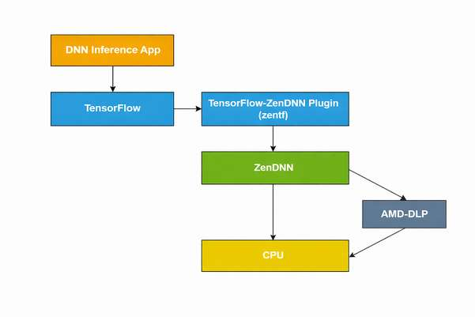

# TensorFlow-ZenDNN Plug-in For AMD CPUs

__The latest ZenDNN Plugin for TensorFlow* (zentf) 5.2 is here!__

The ZenDNN plugin for TensorFlow is called zentf.

This upgrade includes support for a Java interface to zentf through TensorFlow-Java.

zentf 5.2.0 includes enhancements for bfloat16 performance, primarily by leveraging microkernels and operators from the ZenDNN 5.2.0 library. These operators are designed to better leverage the EPYC microarchitecture and cache hierarchy.

The zentf 5.2.0 plugin works seamlessly with TensorFlow versions from 2.19 to 2.16, offering a high-performance experience for deep learning on AMD EPYC™ platforms.

## Support

We welcome feedback, suggestions, and bug reports. Should you have any of the these, please kindly file an issue on the ZenDNN Plugin for TensorFlow Github page: https://github.com/amd/ZenDNN-tensorflow-plugin/issues

## License

AMD copyrighted code in ZenDNN is subject to the [Apache-2.0, MIT, or BSD-3-Clause](https://github.com/amd/ZenDNN-tensorflow-plugin/blob/main/LICENSE) licenses; consult the source code file headers for the applicable license. Third party copyrighted code in ZenDNN is subject to the licenses set forth in the source code file headers of such code.

## Overview

The following is a high-level block diagram for the zentf package which utilizes [ZenDNN](https://github.com/amd/ZenDNN) as the core inference library:



This file shows how to implement, build, install and run a TensorFlow-ZenDNN plug-in for AMD CPUs.

## Supported OS
Refer to the [support matrix](https://www.amd.com/en/developer/zendnn.html#getting-started) for the list of supported operating system.

## Supported User Interfaces
* Python
* Java
* C++

## Prerequisites

| Tools/Frameworks | Version |
| :--------------: | :-----: |
| [Bazel](https://docs.bazel.build/versions/master/install-ubuntu.html) | >=5.3.0 and <=6.5.0 |
| Git | >=1.8 |
| Python | >=3.9 and <=3.12 |
| [TensorFlow](https://www.tensorflow.org/) | >=2.16 and <=2.19 |

# Installation Guide
This section explains how to use the Python interface. For Java and C++ interfaces, kindly look inside the respective folders within the [scripts](./scripts/) folder.
## Prerequisite
* Create conda environment and activate it.
  ```
  $ conda create -n tf-v2.19-zendnn-v5.2.0-rel-env python=3.10 -y
  $ conda activate tf-v2.19-zendnn-v5.2.0-rel-env
  ```
  Note: Python 3.10 used here for example.
* Install TensorFlow v2.19.0
  ```
  $ pip install tensorflow==2.19.0
  ```
## Install zentf wheel.

### 1. Install wheel file using pip:
```
$ pip install zentf==5.2.0
```
### 2. Install zentf using release package.

* Download the package and the user-guide from [AMD developer portal](https://www.amd.com/en/developer/zendnn.html).

* Run the following commands to unzip the package and install the binary.
  > NOTE : We are taking an example for release package with Python version 3.10.

  ```
  $ unzip ZENTF_v5.2.0_Python_v3.10.zip
  $ cd ZENTF_v5.2.0_Python_v3.10/
  $ pip install zentf-5.2.0-cp310-cp310-manylinux_2_28_x86_64.whl
  ```

* To use the recommended environment settings, execute :
  ```
  $ source scripts/zentf_env_setup.sh
  ```

## Build and install from source.
### 1. Clone the repository
```
$ git clone https://github.com/amd/ZenDNN-tensorflow-plugin.git
$ cd ZenDNN-tensorflow-plugin/
```
Note: Repository is defaults to master branch, to build the version 5.2.0 checkout the r5.2 branch.
```
$ git checkout r5.2
```

### 2. Configuring &  Building the TensorFlow-ZenDNN Plug-in using script.
>Note: Configure & Build Tensorflow-ZenDNN Plug-in manually by following the steps [3-6].

```
The setup script will configure & build and install Tensorflow-ZenDNN Plug-in. It will also set the necessary environment variables of ZenDNN execution. However, these variables should be verified empirically.

ZenDNN-tensorflow-plugin$ source scripts/zentf_setup.sh
```
### 3. Configure the build options:
```
ZenDNN-tensorflow-plugin$ ./configure
You have bazel 6.5.0 installed.
Please specify the location of python. [Default is /home/user/anaconda3/envs/zentf-env/bin/python]:

Found possible Python library paths:
  /home/user/anaconda3/envs/zentf-env/lib/python3.10/site-packages
Please input the desired Python library path to use.  Default is [/home/user/anaconda3/envs/zentf-env/lib/python3.10/site-packages]

Do you wish to build TensorFlow plug-in with MPI support? [y/N]:
No MPI support will be enabled for TensorFlow plug-in.

Please specify optimization flags to use during compilation when bazel option "--config=opt" is specified [Default is -march=native -Wno-sign-compare]:

Configuration finished
```

### 4. Build the TensorFlow-ZenDNN Plug-in:
```
ZenDNN-tensorflow-plugin$ bazel clean --expunge
ZenDNN-tensorflow-plugin$ bazel build  -c opt //tensorflow_plugin/tools/pip_package:build_pip_package --verbose_failures --copt=-Wall --copt=-Werror --spawn_strategy=standalone
```

### 5. Generate python wheel file:
```
ZenDNN-tensorflow-plugin$ bazel-bin/tensorflow_plugin/tools/pip_package/build_pip_package .
  Note: It will generate and save python wheel file for TensorFlow-ZenDNN Plug-in into the current directory (i.e., ZenDNN-tensorflow-plugin/).
```

### 6. Install wheel file using pip:
```
ZenDNN-tensorflow-plugin$ pip install zentf-5.2.0-cp310-cp310-linux_x86_64.whl
```

**The build and installation from source is done!**

## Enable TensorFlow-ZenDNN Plug-in:
```
$ export TF_ENABLE_ZENDNN_OPTS=1
$ export TF_ENABLE_ONEDNN_OPTS=0
```
Note: To disable ZenDNN optimizations in your inference execution, you can set the corresponding ZenDNN environment variable `export TF_ENABLE_ZENDNN_OPTS=0`

## Execute sample kernel:
```
ZenDNN-tensorflow-plugin$ python tests/softmax.py
2025-07-09 23:27:04.455149: I tensorflow/core/util/port.cc:180] ZenDNN custom operations are on. You may see slightly different numerical results due to floating-point round-off errors from different computation orders. To turn them off, set the environment variable `TF_ENABLE_ZENDNN_OPTS=0`.
2025-07-09 23:27:04.456705: I external/local_xla/xla/tsl/cuda/cudart_stub.cc:32] Could not find cuda drivers on your machine, GPU will not be used.
2025-07-09 23:27:04.461392: I external/local_xla/xla/tsl/cuda/cudart_stub.cc:32] Could not find cuda drivers on your machine, GPU will not be used.
2025-07-09 23:27:04.471716: E external/local_xla/xla/stream_executor/cuda/cuda_fft.cc:467] Unable to register cuFFT factory: Attempting to register factory for plugin cuFFT when one has already been registered
WARNING: All log messages before absl::InitializeLog() is called are written to STDERR
E0000 00:00:1752125224.487565 3745134 cuda_dnn.cc:8579] Unable to register cuDNN factory: Attempting to register factory for plugin cuDNN when one has already been registered
E0000 00:00:1752125224.492265 3745134 cuda_blas.cc:1407] Unable to register cuBLAS factory: Attempting to register factory for plugin cuBLAS when one has already been registered
W0000 00:00:1752125224.506752 3745134 computation_placer.cc:177] computation placer already registered. Please check linkage and avoid linking the same target more than once.
W0000 00:00:1752125224.506784 3745134 computation_placer.cc:177] computation placer already registered. Please check linkage and avoid linking the same target more than once.
W0000 00:00:1752125224.506788 3745134 computation_placer.cc:177] computation placer already registered. Please check linkage and avoid linking the same target more than once.
W0000 00:00:1752125224.506791 3745134 computation_placer.cc:177] computation placer already registered. Please check linkage and avoid linking the same target more than once.
2025-07-09 23:27:04.510814: I tensorflow/core/platform/cpu_feature_guard.cc:210] This TensorFlow binary is optimized to use available CPU instructions in performance-critical operations.
To enable the following instructions: AVX2 AVX512F AVX512_VNNI AVX512_BF16 FMA, in other operations, rebuild TensorFlow with the appropriate compiler flags.
2025-07-09 23:27:08.109060: E external/local_xla/xla/stream_executor/cuda/cuda_platform.cc:51] failed call to cuInit: INTERNAL: CUDA error: Failed call to cuInit: UNKNOWN ERROR (303)
Tensor("random_normal:0", shape=(10,), dtype=float32)
2025-07-09 23:27:08.907570: I tensorflow/core/common_runtime/direct_session.cc:378] Device mapping: no known devices.
WARNING: All log messages before absl::InitializeLog() is called are written to STDERR
I0000 00:00:1752125228.908789 3745134 mlir_graph_optimization_pass.cc:425] MLIR V1 optimization pass is not enabled
random_normal/RandomStandardNormal: (RandomStandardNormal): /job:localhost/replica:0/task:0/device:CPU:0
2025-07-09 23:27:08.912901: I tensorflow/core/common_runtime/placer.cc:162] random_normal/RandomStandardNormal: (RandomStandardNormal): /job:localhost/replica:0/task:0/device:CPU:0
random_normal/mul: (Mul): /job:localhost/replica:0/task:0/device:CPU:0
2025-07-09 23:27:08.913119: I tensorflow/core/common_runtime/placer.cc:162] random_normal/mul: (Mul): /job:localhost/replica:0/task:0/device:CPU:0
random_normal: (AddV2): /job:localhost/replica:0/task:0/device:CPU:0
2025-07-09 23:27:08.913340: I tensorflow/core/common_runtime/placer.cc:162] random_normal: (AddV2): /job:localhost/replica:0/task:0/device:CPU:0
Softmax: (Softmax): /job:localhost/replica:0/task:0/device:CPU:0
2025-07-09 23:27:08.913537: I tensorflow/core/common_runtime/placer.cc:162] Softmax: (Softmax): /job:localhost/replica:0/task:0/device:CPU:0
random_normal/shape: (Const): /job:localhost/replica:0/task:0/device:CPU:0
2025-07-09 23:27:08.913736: I tensorflow/core/common_runtime/placer.cc:162] random_normal/shape: (Const): /job:localhost/replica:0/task:0/device:CPU:0
random_normal/mean: (Const): /job:localhost/replica:0/task:0/device:CPU:0
2025-07-09 23:27:08.913933: I tensorflow/core/common_runtime/placer.cc:162] random_normal/mean: (Const): /job:localhost/replica:0/task:0/device:CPU:0
random_normal/stddev: (Const): /job:localhost/replica:0/task:0/device:CPU:0
2025-07-09 23:27:08.914123: I tensorflow/core/common_runtime/placer.cc:162] random_normal/stddev: (Const): /job:localhost/replica:0/task:0/device:CPU:0
2025-07-09 23:27:08.914921: I tensorflow/core/grappler/optimizers/custom_graph_optimizer_registry.cc:117] Plugin optimizer for device_type CPU is enabled.

ZenDNN Info: Execution has entered the ZenDNN library. Optimized deep learning kernels are now active for high-performance inference on AMD CPUs.

[0.05660784 0.09040404 0.03201076 0.11204024 0.2344563  0.162052
 0.09466095 0.11205972 0.0752109  0.03049729]
```

# Resources
* [TensorFlow's Pluggable Device blog](https://blog.tensorflow.org/2021/06/pluggabledevice-device-plugins-for-TensorFlow.html)
* [AMD-TensorFlow blog](https://blog.tensorflow.org/2023/03/enabling-optimal-inference-performance-on-amd-epyc-processors-with-the-zendnn-library.html)

# Performance tuning and Benchmarking
* zentf v5.2.0 is supported with ZenDNN v5.2.0. For detailed performance tuning guidelines, refer to the [Performance Tuning](https://docs.amd.com/r/en-US/57300-ZenDNN-user-guide/Performance-Tuning) section of the ZenDNN user guide.
