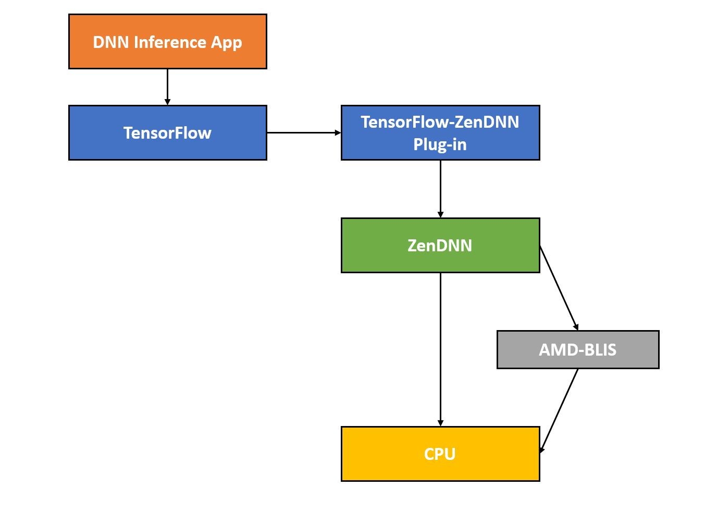

# TensorFlow-ZenDNN Plug-in For AMD CPUs
TensorFlow v2.5 provides a [PluggableDevice mechanism](https://blog.tensorflow.org/2021/06/pluggabledevice-device-plugins-for-TensorFlow.html) that enables modular, plug-and-play integration of device-specific code. AMD adopted PluggableDevice when implementing the TensorFlow-ZenDNN plug-in for AMD EPYC<sup>TM</sup> CPUs and released with the TensorFlow 2.12 ([See the blog announcement](https://blog.tensorflow.org/2023/03/enabling-optimal-inference-performance-on-amd-epyc-processors-with-the-zendnn-library.html)). TensorFlow-ZenDNN plug-in adds custom kernel implementations and operations specific to AMD EPYC<sup>TM</sup> CPUs to TensorFlow through its kernel and op registration C APIs.

TensorFlow-ZenDNN plug-in is a supplemental package to be installed alongside standard TensorFlow packages starting from TF version 2.12 onwards. From a TensorFlow developer’s perspective, the TensorFlow-ZenDNN plug-in approach simplifies the process of leveraging ZenDNN optimizations.

The following is a high-level block diagram for the TensorFlow-ZenDNN plug-in package which utilizes [ZenDNN](https://github.com/amd/ZenDNN) as the core inference library:



This file shows how to implement, build, install and run a TensorFlow-ZenDNN plug-in for AMD CPUs.

## Supported OS
* Linux

## Prerequisites

| Tools/Frameworks | Version |
| :--------------: | :-----: |
| [Bazel](https://docs.bazel.build/versions/master/install-ubuntu.html) | >=3.1 |
| Git | >=1.8 |
| Python | >=3.8 and <=3.11 |
| [TensorFlow](https://www.tensorflow.org/) | >=2.12 |

# Installation Guide

>Note: Make sure you have active conda environment and TensorFlow>=2.12 is installed.

## Install via wheel file.
### 1. Download the wheel file from [here](http://ml-ci.amd.com:21096/view/ZenDNN/job/zendnn/job/tensorflow-zendnn-plugin-build-whl-release/).

### 2. Install wheel file using pip:
```
pip install tensorflow_zendnn_plugin-0.1.0-cp38-cp38-linux_x86_64.whl
```


## Build and install from source.
### 1. Clone the repository
```
$ git clone https://github.com/amd/ZenDNN-tensorflow-plugin.git
$ cd ZenDNN-tensorflow-plugin/
```
### 2. Configure the build options:
```
ZenDNN-tensorflow-plugin$ ./configure
You have bazel 5.3.0 installed.
Please specify the location of python. [Default is /home/user/anaconda3/envs/tf-2.14-zendnn-plugin-env/bin/python]:

Found possible Python library paths:
  /home/user/anaconda3/envs/tf-2.14-check-env/lib/python3.8/site-packages
Please input the desired Python library path to use.  Default is [/home/user/anaconda3/envs/tf-2.14-zendnn-plugin-env/lib/python3.8/site-packages]

Do you wish to build TensorFlow plug-in with MPI support? [y/N]:
No MPI support will be enabled for TensorFlow plug-in.

Please specify optimization flags to use during compilation when bazel option "--config=opt" is specified [Default is -march=native -Wno-sign-compare]:

Configuration finished
```

### 3. Build the TensorFlow-ZenDNN Plug-in:
```
ZenDNN-tensorflow-plugin$ bazel build  -c opt //tensorflow_plugin/tools/pip_package:build_pip_package --verbose_failures --spawn_strategy=standalone
```

### 4. Generate python wheel file:
```
ZenDNN-tensorflow-plugin$ bazel-bin/tensorflow_plugin/tools/pip_package/build_pip_package .
  Note: It will generate and save python wheel file for TensorFlow-ZenDNN Plug-in into the current directory (i.e., ZenDNN-tensorflow-plugin/).
```

### 5. Install wheel file using pip:
```
pip install tensorflow_zendnn_plugin-0.1.0-cp38-cp38-linux_x86_64.whl
```

**The build and installation from source is done!**

## Enable TensorFlow-ZenDNN Plug-in:
```
$ export TF_ENABLE_ZENDNN_OPTS=1
$ export TF_ENABLE_ONEDNN_OPTS=0
```
Note: To disable ZenDNN optimizations in your inference execution, you can set the corresponding ZenDNN environment variable `export TF_ENABLE_ZENDNN_OPTS=0`

## Execute sample kernel:
```
ZenDNN-tensorflow-plugin$ python tests/softmax.py
2023-07-13 15:10:56.178652: I tensorflow/core/platform/cpu_feature_guard.cc:182] This TensorFlow binary is optimized to use available CPU instructions in performance-critical operations.
To enable the following instructions: FMA, in other operations, rebuild TensorFlow with the appropriate compiler flags.
2023-07-13 15:10:57.097190: I tensorflow/core/common_runtime/direct_session.cc:380] Device mapping: no known devices.
2023-07-13 15:10:57.097539: I tensorflow/compiler/mlir/mlir_graph_optimization_pass.cc:380] MLIR V1 optimization pass is not enabled
random_normal/RandomStandardNormal: (RandomStandardNormal): /job:localhost/replica:0/task:0/device:CPU:0
2023-07-13 15:10:57.098688: I tensorflow/core/common_runtime/placer.cc:114] random_normal/RandomStandardNormal: (RandomStandardNormal): /job:localhost/replica:0/task:0/device:CPU:0
random_normal/mul: (Mul): /job:localhost/replica:0/task:0/device:CPU:0
2023-07-13 15:10:57.098698: I tensorflow/core/common_runtime/placer.cc:114] random_normal/mul: (Mul): /job:localhost/replica:0/task:0/device:CPU:0
random_normal: (AddV2): /job:localhost/replica:0/task:0/device:CPU:0
2023-07-13 15:10:57.098705: I tensorflow/core/common_runtime/placer.cc:114] random_normal: (AddV2): /job:localhost/replica:0/task:0/device:CPU:0
Softmax: (Softmax): /job:localhost/replica:0/task:0/device:CPU:0
2023-07-13 15:10:57.098715: I tensorflow/core/common_runtime/placer.cc:114] Softmax: (Softmax): /job:localhost/replica:0/task:0/device:CPU:0
random_normal/shape: (Const): /job:localhost/replica:0/task:0/device:CPU:0
2023-07-13 15:10:57.098722: I tensorflow/core/common_runtime/placer.cc:114] random_normal/shape: (Const): /job:localhost/replica:0/task:0/device:CPU:0
random_normal/mean: (Const): /job:localhost/replica:0/task:0/device:CPU:0
2023-07-13 15:10:57.098728: I tensorflow/core/common_runtime/placer.cc:114] random_normal/mean: (Const): /job:localhost/replica:0/task:0/device:CPU:0
random_normal/stddev: (Const): /job:localhost/replica:0/task:0/device:CPU:0
2023-07-13 15:10:57.098734: I tensorflow/core/common_runtime/placer.cc:114] random_normal/stddev: (Const): /job:localhost/replica:0/task:0/device:CPU:0
2023-07-13 15:10:57.125282: I tensorflow/core/util/port.cc:142] ZenDNN custom operations are on. You may see slightly different numerical results due to floating-point round-off errors from different computation orders. To turn them off, set the environment variable `TF_ENABLE_ZENDNN_OPTS=0`.
[0.05660784 0.09040404 0.03201076 0.11204024 0.2344563  0.162052
 0.09466095 0.11205972 0.0752109  0.03049729]
```

# Resources
* [TensorFlow's Pluggable Device blog](https://blog.tensorflow.org/2021/06/pluggabledevice-device-plugins-for-TensorFlow.html)
* [AMD-TensorFlow blog](https://blog.tensorflow.org/2023/03/enabling-optimal-inference-performance-on-amd-epyc-processors-with-the-zendnn-library.html)
* [Download TensorFlow-ZenDNN Plug-in binary](http://ml-ci.amd.com:21096/view/ZenDNN/job/zendnn/job/tensorflow-zendnn-plugin-build-whl-release/)
* [TensorFlow-ZenDNN Plug-in User Guide](https://www.amd.com/content/dam/amd/en/documents/developer/tensorflow-zendnn-plug-in-user-guide.pdf)

# Performace tuning and Benchmarking
* As compared to the current TensorFlow-ZenDNN direct integration releases, this release provides on par performance for models, such as RefineDet, Inception, and VGG variants and sub-optimal performance for models, such as ResNet, MobileNet and EfficientNet.
* TensorFlow-ZenDNN plug-in is supported with ZenDNN v3.3 above. Please see Chapter 5 of the [TensorFlow-ZenDNN Plug-in User Guide](https://www.amd.com/content/dam/amd/en/documents/developer/tensorflow-zendnn-plug-in-user-guide.pdf) for performance tuning guidelines.

Note: AMD recommends using the TF-ZenDNN direct integration binaries available on the [AMD ZenDNN developer resources page](https://www.amd.com/en/developer/zendnn.html) for optimal inference performance.

# Support
* Please email zendnnsupport@amd.com for questions, issues, and feedback.

* Please submit your questions, feature requests, and bug reports on the
[GitHub issues](https://github.com/amd/ZenDNN-tensorflow-plugin/issues) page.